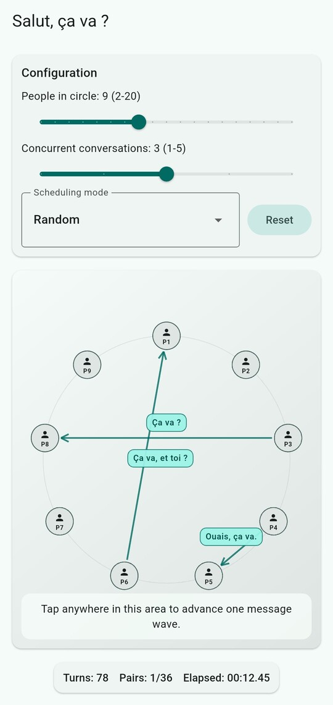

# Salut, ça va ?

Flutter simulator for the 2-step French greeting protocol in multi-person
conversations.



## What?

In France, people greet each other with two conversation turns that look like a TCP handshake:

    Person A: "Salut"
    Person B: "Salut, ca va?"
    Person A: "Ca va, et toi?"
    Person B: "Ouais, ca va."

Only after this exchange can the conversation proceed to other topics. Additionally, in a multi-person conversation, each person must greet every other person before the conversation can proceed.

### 2-step protocol variant

To not lock a pair of people for too much, since they might be busy discussing with someone or anything, a variation of the protocol is often used, which is less efficient but divided into two different batches, that can be interrupted.

## Features

- Configurable people count from 2 to 20.
- Configurable concurrent conversations from 1 to 5.
- Deterministic and random pair scheduling.
- Tap-to-advance simulation (one message per tap).
- Circular visualization with directional arrows and speech bubbles.
- Completion summary with total conversation turns and elapsed real time.

## Nix Development Environment

This repository includes a `flake.nix` dev shell with Flutter, Android SDK, and
Java.

The Nix SDK now includes Flutter's required NDK (`28.2.13676358`), so builds can
run directly from the immutable Nix SDK without copying SDK/NDK directories into
the project.

If you used the previous local SDK workaround, remove the override once:

```bash
rm -rf .android-sdk
rm -f android/local.properties
```

```bash
nix develop
flutter doctor
flutter run
```

## Quality Checks

```bash
flutter analyze
flutter test
```

## GitHub Automation

- CI workflow: [`.github/workflows/ci.yml`](.github/workflows/ci.yml)
	It verifies formatting, runs analysis/tests, and builds an arm64-v8a release
	APK artifact on push/PR.
- Dependabot: [`.github/dependabot.yml`](.github/dependabot.yml)
	It opens weekly update PRs for `pub` dependencies and GitHub Actions.

## Initial prompt

See initial_prompt.md for the original prompt that led to this project.  